# Academic Events API

API REST para la gestion de eventos academicos (categorias, eventos, sesiones, inscripciones, reportes y autenticacion).
Proyecto backend con Java 21, Spring Boot, PostgreSQL y Redis.

## 1) Tecnologias utilizadas

- Java 21
- Spring Boot 4.1.0
- Spring Web, Spring Data JPA, Spring Security, Validation, Actuator
- JWT (access token + refresh token)
- BCrypt
- PostgreSQL
- Redis
- Docker Compose
- OpenAPI/Swagger (springdoc)
- Apache POI (Excel) y OpenPDF (PDF)
- Gradle (Kotlin DSL)

## 2) Arquitectura del proyecto

Paquete base:

- ec.edu.ups.academic_events_api

Organizacion por modulos y capas:

- controllers
- dtos
- entities
- mappers
- repositories
- services

Modulos principales:

- security
- users
- categories
- events
- sessions
- registrations
- reports
- core

## 3) Requisitos previos

- Java 21
- Docker Desktop
- Git

## 4) Configuracion de variables de entorno

Variables principales para perfil dev:

| Variable               | Valor por defecto                                                         |
| ---------------------- | ------------------------------------------------------------------------- |
| SERVER_PORT            | 8080                                                                      |
| SPRING_PROFILES_ACTIVE | dev                                                                       |
| DB_URL                 | jdbc:postgresql://localhost:5433/academic_events_db                       |
| DB_USERNAME            | ups                                                                       |
| DB_PASSWORD            | ups123                                                                    |
| REDIS_HOST             | localhost                                                                 |
| REDIS_PORT             | 6379                                                                      |
| REDIS_PASSWORD         | (vacio)                                                                   |
| JWT_SECRET             | development-secret-key-for-academic-events-api-2026-minimum-32-characters |
| JWT_ACCESS_EXPIRATION  | 900000                                                                    |
| JWT_REFRESH_EXPIRATION | 604800000                                                                 |

Ejemplo rapido en PowerShell (solo para la sesion actual):

```powershell
$env:SPRING_PROFILES_ACTIVE="dev"
$env:DB_URL="jdbc:postgresql://localhost:5433/academic_events_db"
$env:DB_USERNAME="ups"
$env:DB_PASSWORD="ups123"
$env:REDIS_HOST="localhost"
$env:REDIS_PORT="6379"
```

## 5) Levantar PostgreSQL y Redis con Docker Compose

Contenedores esperados:

- academic-events-postgres
- academic-events-redis

Comandos:

```powershell
docker compose up -d
docker compose ps
docker exec academic-events-redis redis-cli ping
```

Puertos locales:

- API: 8080
- PostgreSQL: 5433
- Redis: 6379

Base de datos principal:

- academic_events_db

## 6) Ejecutar scripts SQL desde PowerShell

Crear base de datos:

```powershell
Get-Content -Raw .\src\main\sql\00_create_database.sql |
docker exec -i academic-events-postgres psql -U ups -d postgres
```

Cargar esquema y datos:

```powershell
Get-Content -Raw .\src\main\sql\V1__initial_schema_and_data.sql |
docker exec -i academic-events-postgres psql -U ups -d academic_events_db
```

## 7) Compilar y ejecutar Spring Boot

```powershell
.\gradlew clean build
.\gradlew bootRun
```

La API inicia en:

- http://localhost:8080/api

## 8) Roles y permisos principales

Roles del sistema:

- ADMIN
- ORGANIZER
- PARTICIPANT

Permisos generales:

- ADMIN: gestion de usuarios, roles y acceso completo.
- ORGANIZER: gestion de recursos propios de eventos (segun validacion de propiedad).
- PARTICIPANT: inscripciones y operaciones de participante autenticado.

## 9) JWT y refresh token (resumen)

- Login devuelve access token y refresh token.
- El access token se usa para acceder a endpoints protegidos.
- Cuando expira el access token, se usa refresh para obtener uno nuevo.
- Logout invalida/revoca tokens segun la logica de seguridad.
- Contrasenas almacenadas con BCrypt.

## 10) Uso resumido de Redis

Redis se usa para:

- rate limiting en login
- bloqueos temporales por intentos fallidos
- revocacion de tokens

## 11) Endpoints principales

Context path de la API: /api

### Autenticacion

| Metodo | Endpoint solicitado | Estado       |
| ------ | ------------------- | ------------ |
| POST   | /api/auth/register  | Implementado |
| POST   | /api/auth/login     | Implementado |
| POST   | /api/auth/refresh   | Implementado |
| POST   | /api/auth/logout    | Implementado |
| GET    | /api/auth/me        | Implementado |

### Categorias

| Metodo | Endpoint solicitado  | Estado       |
| ------ | -------------------- | ------------ |
| GET    | /api/categories      | Implementado |
| POST   | /api/categories      | Implementado |
| PUT    | /api/categories/{id} | Implementado |
| DELETE | /api/categories/{id} | Implementado |

### Eventos

| Metodo | Endpoint solicitado     | Estado                                 |
| ------ | ----------------------- | -------------------------------------- |
| GET    | /api/events             | Implementado                           |
| GET    | /api/events/{id}        | Implementado                           |
| POST   | /api/events             | Implementado                           |
| PUT    | /api/events/{id}        | Implementado                           |
| PATCH  | /api/events/{id}/status | > Estado: pendiente de implementación. |
| DELETE | /api/events/{id}        | Implementado                           |

### Sesiones

| Metodo | Endpoint solicitado            | Estado                                 |
| ------ | ------------------------------ | -------------------------------------- |
| GET    | /api/events/{eventId}/sessions | > Estado: pendiente de implementación. |
| POST   | /api/events/{eventId}/sessions | > Estado: pendiente de implementación. |
| PUT    | /api/sessions/{id}             | Implementado                           |
| DELETE | /api/sessions/{id}             | Implementado                           |

Rutas actuales implementadas para sesiones:

- GET /api/sessions
- GET /api/sessions/{id}
- POST /api/sessions
- GET /api/sessions/event/{eventId}

### Inscripciones

| Metodo | Endpoint solicitado                 | Estado                                 |
| ------ | ----------------------------------- | -------------------------------------- |
| POST   | /api/events/{eventId}/registrations | > Estado: pendiente de implementación. |
| GET    | /api/registrations/me               | > Estado: pendiente de implementación. |
| DELETE | /api/registrations/{id}             | Implementado                           |

Rutas actuales implementadas para inscripciones:

- GET /api/registrations
- GET /api/registrations/{id}
- POST /api/registrations
- PATCH /api/registrations/{id}/status
- GET /api/registrations/event/{eventId}
- GET /api/registrations/participant/{participantId}

### Reportes

| Metodo | Endpoint solicitado                              | Estado                                 |
| ------ | ------------------------------------------------ | -------------------------------------- |
| GET    | /api/reports/events/{eventId}/registrations.pdf  | > Estado: pendiente de implementación. |
| GET    | /api/reports/events/{eventId}/registrations.xlsx | > Estado: pendiente de implementación. |
| GET    | /api/registrations/{id}/certificate.pdf          | > Estado: pendiente de implementación. |

Rutas actuales implementadas para reportes:

- GET /api/reports/events/{eventId}/registrations/pdf
- GET /api/reports/events/{eventId}/registrations/excel
- GET /api/reports/registrations/{registrationId}/certificate

### Estado

| Metodo | Endpoint solicitado  | Estado       |
| ------ | -------------------- | ------------ |
| GET    | /api/actuator/health | Implementado |

Tambien existe:

- GET /api/status

## 12) Pruebas

Ejecutar pruebas:

```powershell
.\gradlew bootRun --args="--spring.profiles.active=dev"
.\gradlew clean bootRun --args="--spring.profiles.active=prod"
```

## 13) Estado o salud de la aplicacion

Validar salud:

```powershell
Invoke-RestMethod -Method GET -Uri "http://localhost:8080/api/actuator/health"
```

Respuesta esperada (ejemplo):

```json
{
  "status": "UP"
}
```

## 16) Notas

- Perfil por defecto: dev
- Contenedor PostgreSQL: academic-events-postgres
- Contenedor Redis: academic-events-redis
- Scripts SQL: src/main/sql/00_create_database.sql y src/main/sql/V1\_\_initial_schema_and_data.sql

# 17) Evidencias de pruebas funcionales

## 17.1 Organizador modifica un evento ajeno

Esta prueba permite comprobar que un organizador no puede modificar un evento perteneciente a otro organizador.

Se inició sesión con María Cordero y se intentó actualizar el evento número 2, perteneciente a José Mora.

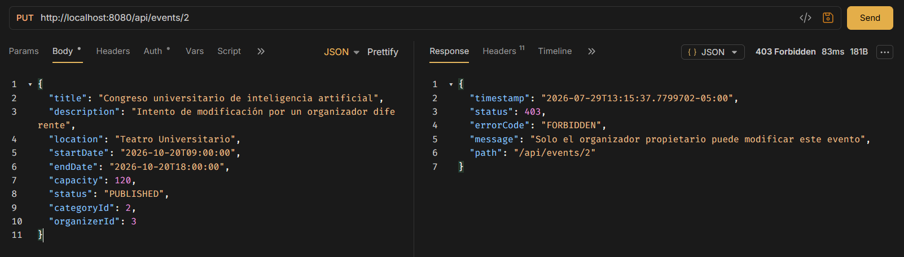

## 17.2 Inscripción duplicada

Esta prueba comprueba que un participante no pueda registrarse dos veces en el mismo evento.

Se intentó crear una nueva inscripción para un participante que ya estaba registrado previamente.

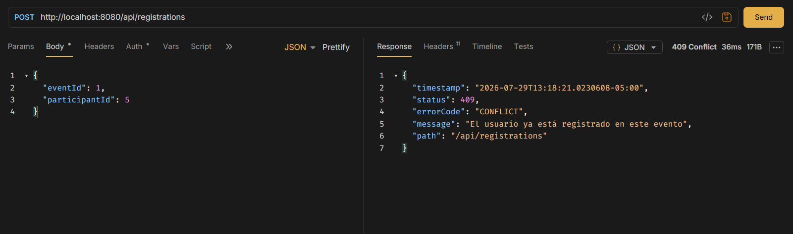

## 17.3 Inscripción en evento finalizado

Esta prueba comprueba que el sistema no permita nuevas inscripciones en eventos que ya finalizaron.

Se intentó registrar un participante en el evento número 6, cuyo estado era FINISHED

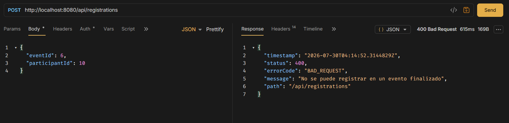

## 17.4 Inscripción en evento no publicado

Esta prueba verifica que las inscripciones únicamente se permitan en eventos con estado PUBLISHED.

Se intentó registrar un participante en el evento número 4, cuyo estado era DRAFT.

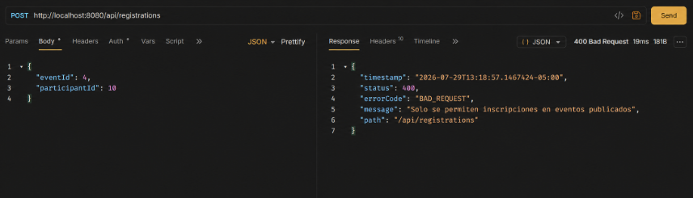

## 17.5 Evento sin cupos disponibles

Esta prueba permite comprobar que el sistema no permita registrar más participantes cuando la capacidad disponible del evento llega a cero.

Primero se creó un evento con capacidad de una persona. Después se creó y confirmó una inscripción, dejando el evento sin cupos disponibles.

Finalmente, se intentó registrar un segundo participante.

### Evidencia 1: evento sin cupos

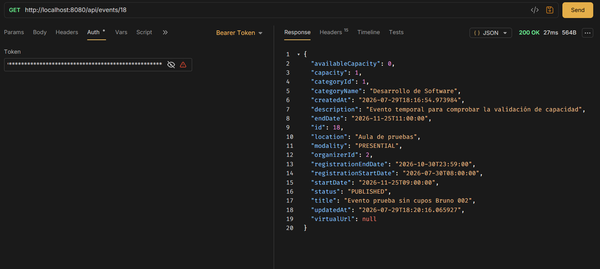

### Evidencia 2: nueva inscripción rechazada

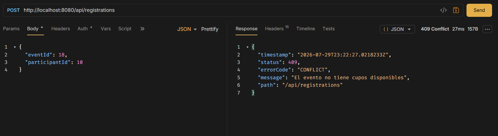

## 17.6 Transacción de inscripción y disponibilidad

Esta prueba comprueba que la disponibilidad del evento se actualice correctamente al cambiar el estado de una inscripción.

Al confirmar una inscripción, la capacidad disponible disminuyó en una unidad. Posteriormente, al cancelar la inscripción, el cupo fue restaurado.

### Evidencia 1: capacidad inicial

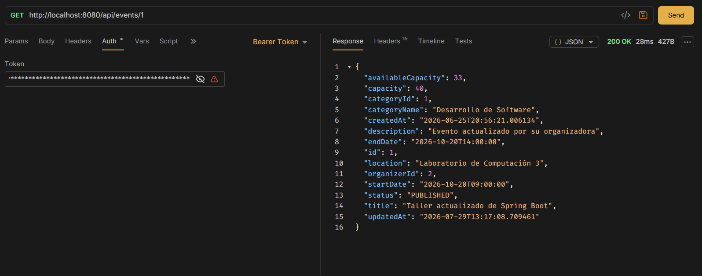

### Evidencia 2: inscripción confirmada

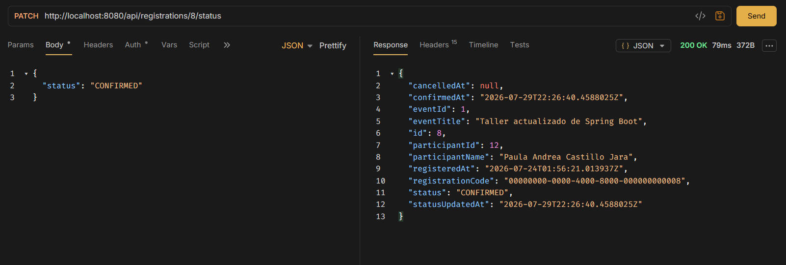

### Evidencia 3: capacidad disminuida

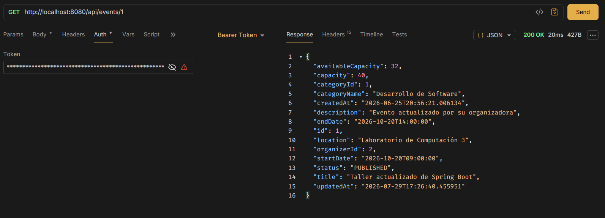

### Evidencia 4: capacidad restaurada


## 17.7 Eliminación de evento con inscripciones

Esta prueba verifica que un evento con inscripciones asociadas no pueda ser eliminado.
Se intentó eliminar el evento número 1, el cual ya tenía participantes registrados.

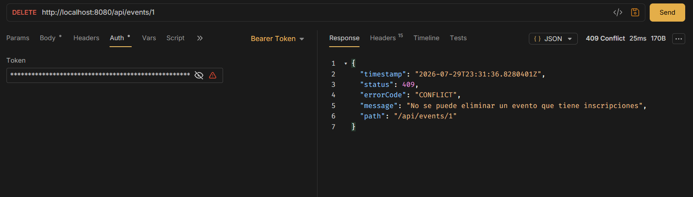

## 17.8 Estadísticas por rango de fechas

Esta prueba permite comprobar la generación de estadísticas de eventos e inscripciones dentro de un rango de fechas.

### Evidencia 1: rango válido

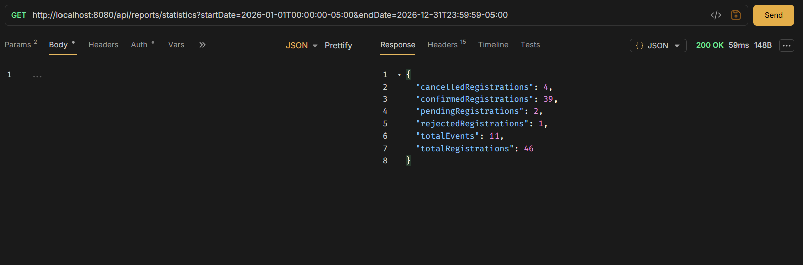

### Evidencia 2: rango inválido

También se probaron fechas invertidas, colocando startDate después de endDate.

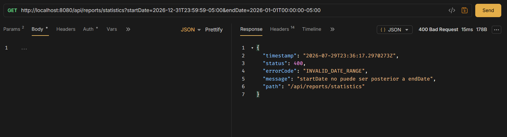

## 17.9 Reporte PDF de inscritos

Esta prueba verifica la generación del reporte de participantes inscritos en formato PDF.

La propietaria del evento solicitó el reporte correctamente.

### Evidencia 1: respuesta del endpoint y visualización del archivo

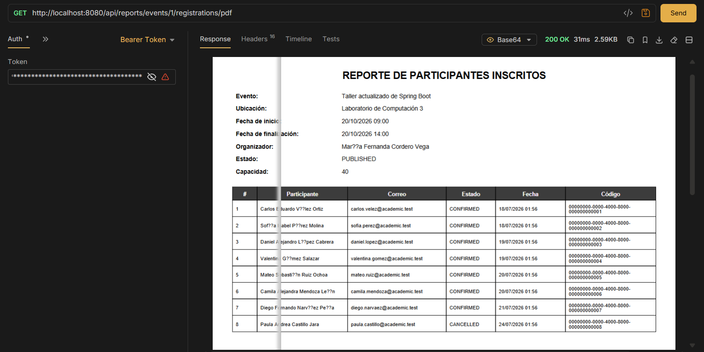

### Evidencia 2: acceso denegado

Intento realizado por un organizador ajeno
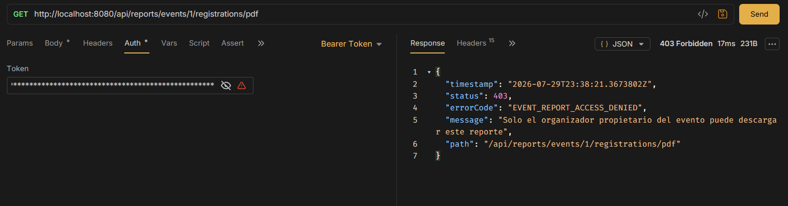

## 17.10 Reporte Excel de inscritos

Esta prueba verifica la generación del reporte de inscritos en formato Excel.

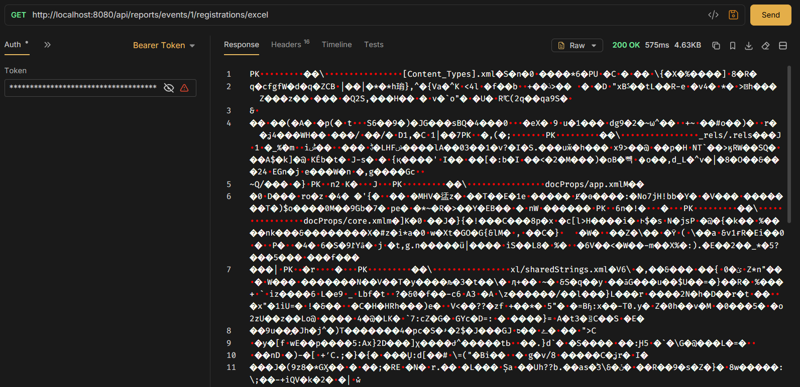
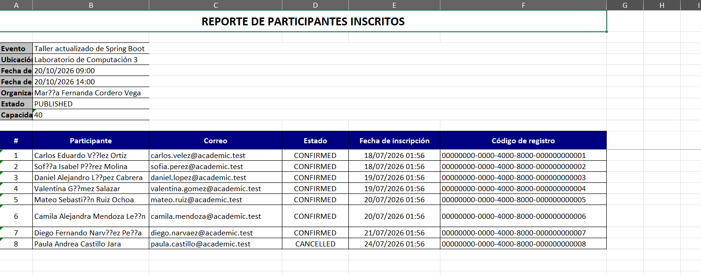

## 17.11 Certificado PDF

Esta prueba permite comprobar la generación segura de certificados de participación.

Primero, el participante propietario de una inscripción confirmada solicitó su certificado.

### Evidencia 1: certificado generado y visualización

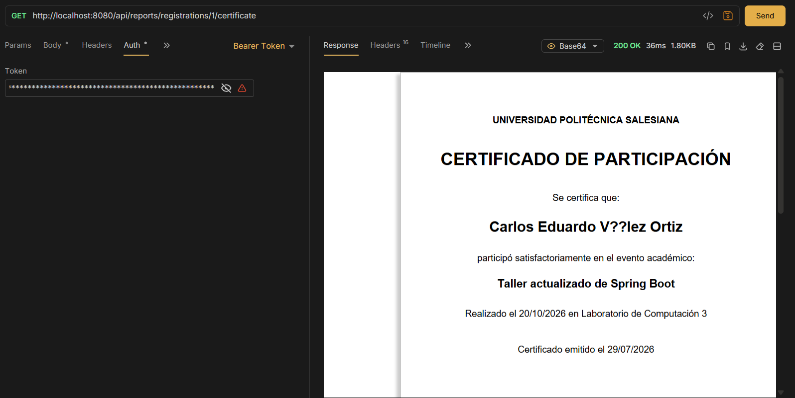

### Evidencia 3: participante diferente

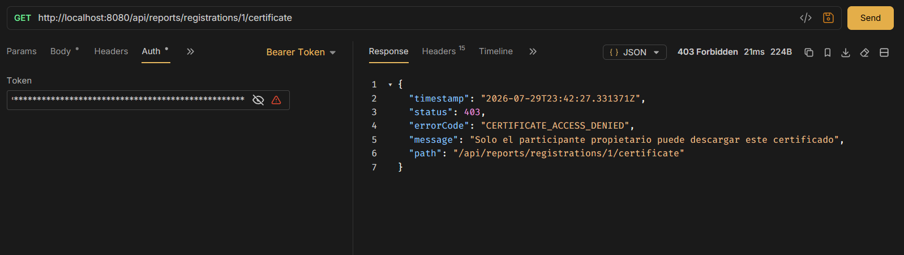

### Evidencia 4: inscripción pendiente

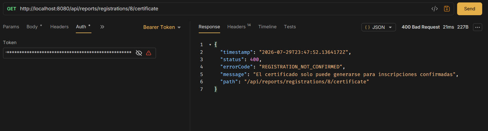

## 17.12 Pruebas automatizadas

Finalmente, se ejecutaron las pruebas automatizadas del proyecto mediante Gradle.

El reporte generado **mostró**:
17 tests
0 failures
0 skipped
100% successful
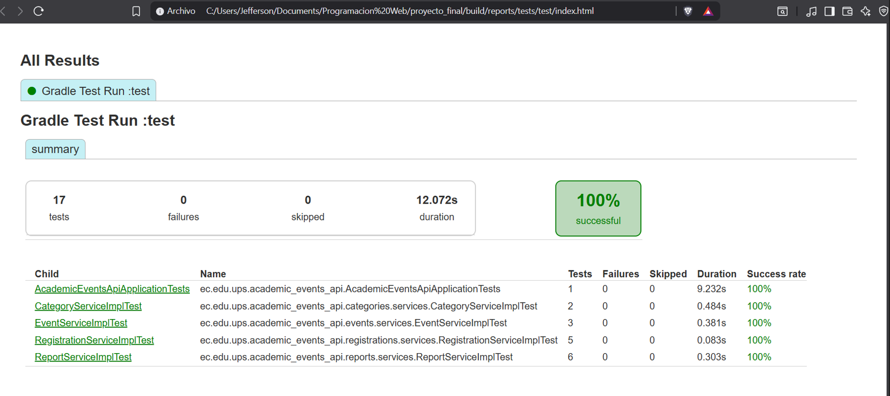
